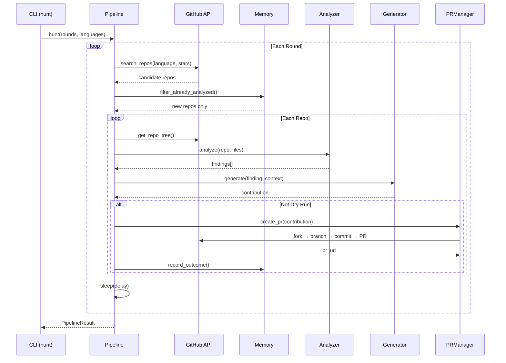

# Architecture

ContribAI v5.5.0 — Rust-native autonomous contribution agent.

## System Overview

```
                           ┌─────────────────────────────┐
                           │      ContribAI Pipeline      │
                           └─────────────┬───────────────┘
                                         │
                    ┌────────────────────▼────────────────────┐
                    │         Middleware Chain (5)             │
                    │  RateLimit → Validation → Retry         │
                    │           → DCO → QualityGate           │
                    └────────────────────┬───────────────────┘
                                         │
            ┌────────────────────────────▼─────────────────────────────┐
            │                    Sub-Agent Registry (5)                  │
            │  ┌──────────┐ ┌──────────┐ ┌────────┐ ┌────────────┐   │
            │  │ Analyzer │ │Generator │ │ Patrol │ │ Compliance │   │
            │  └────┬─────┘ └────┬─────┘ └───┬────┘ └─────┬──────┘   │
            └───────┼────────────┼───────────┼─────────────┼──────────┘
                    │            │           │             │
            ┌───────▼────┐ ┌────▼────┐ ┌────▼────┐ ┌─────▼────┐
            │   Skills   │ │  LLM    │ │ GitHub  │ │   DCO    │
            │ (17 total) │ │Provider │ │  REST+  │ │  Signoff │
            └────────────┘ └─────────┘ │ GraphQL │ └──────────┘
                    │            │      └─────────┘
                    ▼            ▼           │
            ┌─────────────────────────────────────────┐
            │          Working Memory (SQLite)          │
            │  analyzed_repos │ submitted_prs           │
            │  pr_outcomes    │ repo_preferences        │
            │  findings_cache │ run_log | ci_monitor    │
            │  working_memory (72h TTL per repo)        │
            └─────────────────────────────────────────┘
                    │                       │
            ┌───────▼────┐         ┌────────▼────────┐
            │ EventBus   │         │ContextCompressor │
            │ (15 events)│         │ (LLM + truncate) │
            └────────────┘         └─────────────────┘
```

## Module Map

All source in `crates/contribai-rs/src/`:

| Module | Purpose | Key Files |
|--------|---------|-----------|
| `cli/` | 40+ commands + ratatui TUI | `mod.rs`, `tui.rs`, `wizard.rs`, `config_editor.rs` |
| `core/` | Config, models, middleware, events | `config.rs`, `events.rs` |
| `analysis/` | Code analysis + 17 skills | `analyzer.rs`, `skills.rs`, `context_compressor.rs` |
| `llm/` | Multi-provider LLM + 5 sub-agents | `provider.rs`, `agents.rs` |
| `github/` | GitHub REST + GraphQL + discovery | `client.rs`, `discovery.rs` |
| `generator/` | Code generation + self-review + scoring | `engine.rs`, `scorer.rs` |
| `pr/` | PR lifecycle + patrol | `manager.rs`, `patrol.rs` |
| `orchestrator/` | Pipeline + hunt + memory | `pipeline.rs`, `memory.rs` |
| `issues/` | Issue solving | `solver.rs` |
| `mcp/` | 21-tool MCP server (stdio JSON-RPC) | `server.rs`, `client.rs` |
| `web/` | axum dashboard + webhooks + auth | `mod.rs` |
| `sandbox/` | Docker + local code validation | `sandbox.rs` |
| `scheduler/` | Tokio cron automation | (mod) |
| `tools/` | MCP-inspired tool protocol | `protocol.rs` |

## Data Flow

### Standard Pipeline

```
1. Discovery      → GitHub Search API finds candidate repos
2. Analysis       → 7 LLM-powered analyzers run in parallel
   └── Skills     → 17 progressive skills, language-aware
3. Validation     → LLM deep-validates findings against file context
4. Generation     → LLM generates code fix + self-review
5. Quality Gate   → 7-check scorer (correctness, style, safety, etc.)
6. PR Creation    → Fork → Branch → Commit (DCO) → PR
7. CI Monitor     → Auto-close PRs that fail CI
```

### Hunt Mode (v5.3.0+)

```
for round in 1..N:
    1. Vary star range + languages (rotate sort order for diversity)
    2. Discover repos (random tier selection)
    3. Apply watchlist filter if configured (targeted repos)
    4. Filter: skip analyzed, check merge history
    5. Process each repo through standard pipeline
    6. Sleep between rounds (configurable delay)
```



### PR Patrol (v5.4.0+)

```
for each open PR:
    1. Fetch reviews + comments + conversation history
    2. Filter bot comments (11+ known bots)
    3. Classify feedback (CODE_CHANGE, QUESTION, STYLE_FIX, etc.)
    4. Maintain conversation context for intelligent responses
    5. Generate fix via LLM → push commit
    6. Respond to questions via LLM
    7. Auto-clean 404 PRs (v5.5.0)
```

## Middleware Chain

| Order | Middleware | Purpose |
|-------|-----------|---------|
| 1 | `RateLimitMiddleware` | Check daily PR limit + API rate |
| 2 | `ValidationMiddleware` | Validate repo data exists |
| 3 | `RetryMiddleware` | 2 retries with exponential backoff |
| 4 | `DCOMiddleware` | Compute Signed-off-by from user profile |
| 5 | `QualityGateMiddleware` | Score check (min 0.6/1.0) |

## Progressive Skill Loading

17 built-in skills loaded on-demand by language/framework:

| Category | Skills |
|----------|--------|
| Universal | `security`, `code_quality` |
| Python | `python_specific`, `django_security`, `flask_security`, `fastapi_patterns` |
| JavaScript/TS | `javascript_specific`, `react_patterns`, `express_security` |
| Go | `go_specific` |
| Rust | `rust_specific` |
| Java/Kotlin | `java_specific` |
| General | `docs`, `performance`, `refactor`, `ui_ux` |

**Framework detection** auto-identifies: Django, Flask, FastAPI, Express, React, Next.js, Vue, Svelte, Angular, Spring, Rails.

## Sub-Agent Registry

5 built-in agents with parallel execution:

| Agent | Role |
|-------|------|
| `AnalyzerAgent` | Code analysis |
| `GeneratorAgent` | Fix generation |
| `PatrolAgent` | PR monitoring |
| `ComplianceAgent` | CLA/DCO/CI |
| `IssueAgent` | Issue solving |

## Database Schema (SQLite — 7 tables)

| Table | Purpose |
|-------|---------|
| `analyzed_repos` | Track analyzed repositories |
| `submitted_prs` | All PRs created by ContribAI |
| `findings_cache` | Cached analysis results (72h TTL) |
| `run_log` | Pipeline execution history |
| `pr_outcomes` | PR merge/close outcomes for learning |
| `repo_preferences` | Learned repo patterns |
| `ci_monitor` | CI status tracking |

## Troubleshooting

| Symptom | Cause | Fix |
|---------|-------|-----|
| `429 RESOURCE_EXHAUSTED` during hunt | Gemini API rate limit | Reduce rounds, add delay |
| Hunt returns 0 repos after first run | Memory dedup filters analyzed repos | Delete `~/.contribai/memory.db` |
| `gh release create` hangs in PowerShell | Backticks/multiline in `--notes` | Use `--notes-file notes.md` instead |
| `Database locked` | Concurrent access | Wait and retry |
| Link errors on build | Missing C compiler/OpenSSL | Install `gcc`, `libssl-dev` |
